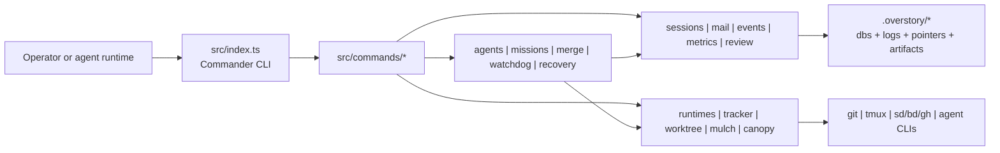
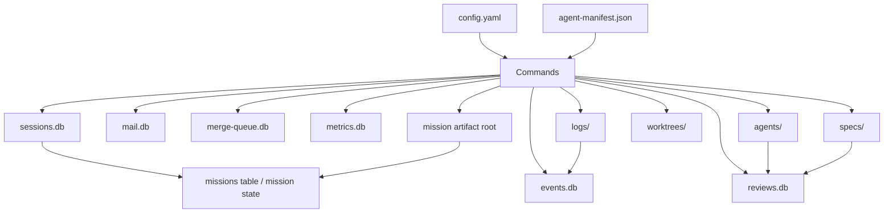

# Overstory Architecture Overview

Repository review date: 2026-04-04
Inspected commit: `8f67ed6c`
Delta from previous review (2026-03-22, `6359e58`): 637 commits, 77.6K insertions, 10.4K deletions

## 1. What This System Is

Overstory is a CLI-first multi-agent orchestration engine for coding agents.

At the repository level, the project is best described as:

- a **modular monolith**
- with a **Commander-based CLI application shell**
- backed by **SQLite + filesystem state inside `.overstory/`**
- with **adapter boundaries** around external runtimes, trackers, git, tmux, and sibling os-eco tools

It is **not** a strict hexagonal architecture today. The codebase has some adapter-style boundaries, but many command handlers still orchestrate persistence, external process control, and domain logic directly.

## 2. Shape Of The Codebase

Implementation footprint from direct repository inspection:

| Metric | Value |
| --- | --- |
| Production TypeScript files | 339 |
| Test TypeScript files | 251 |
| Production TypeScript LOC | 88,748 |
| Test TypeScript LOC | 102,547 |
| Command modules in `src/commands` | 58 |
| Mission modules in `src/missions` | 37 |
| Runtime adapters in `src/runtimes` | 14 |
| Base agent definitions in `agents/` | 31 |

Large production hotspots:

| File | Approx LOC | Role |
| --- | ---: | --- |
| `src/watchdog/daemon.ts` | 2,127 | tier-0 health loop, escalation, reconciliation, mission engine tick |
| `src/missions/store.ts` | 1,214 | mission records and state inside sessions.db |
| `src/commands/coordinator.ts` | 1,184 | persistent coordinator lifecycle |
| `src/commands/completions.ts` | 1,102 | shell completions generation |
| `src/config.ts` | 1,066 | config parsing, loading, migration orchestration |
| `src/commands/sling.ts` | 1,062 | worker spawn CLI wiring, delegates to SpawnService |
| `src/mail/store.ts` | 1,054 | messaging store with migrations and DLQ |
| `src/commands/mail.ts` | 998 | message CLI and delivery flows |
| `src/merge/resolver.ts` | 932 | tiered merge conflict resolution |
| `src/commands/log.ts` | 926 | hook event logging |

High fan-in shared modules:

| Module | Imported by approx files | Meaning |
| --- | ---: | --- |
| `src/types.ts` | 133 | barrel re-export of 29 domain type files (see `src/*/types.ts`) |
| `src/errors.ts` | 72 | global error vocabulary |
| `src/config.ts` | 74 | global config entry point |
| `src/events/store.ts` | 22 | common observability store |
| `src/sessions/store.ts` | 20 | common lifecycle store |

Note: `src/types.ts` was decomposed from a monolithic shared-kernel schema into a barrel re-export. Actual type definitions now live in 29 domain-specific type files (`src/agents/types.ts`, `src/missions/types.ts`, `src/mail/types.ts`, etc.). New code should import directly from the domain type files.

## 3. Architectural Categories

### 3.1 Interface Layer

| Category | Primary paths | Responsibility |
| --- | --- | --- |
| CLI entry | `src/index.ts` | global flags, command registration, top-level error handling |
| Command handlers | `src/commands/*` | application shell, operator UX, orchestration entry points |
| Prompt assets | `agents/`, `templates/` | base agent behavior, overlay templates, hook templates |

Notes:

- `src/index.ts` is a thin router, but `src/commands/*` contains most application logic.
- The command layer is the main integration surface between user intent and the orchestration engine.

### 3.2 Orchestration Core

| Category | Primary paths | Responsibility |
| --- | --- | --- |
| Agent lifecycle | `src/agents/*` | manifest, identities, overlays, hooks, persistent-root lifecycle |
| Mission orchestration | `src/missions/*`, `src/commands/mission.ts` | long-running objective management, mission artifacts, workstreams, mission roles |
| Merge orchestration | `src/merge/*`, `src/commands/merge.ts` | merge queue and tiered conflict resolution |
| Health/recovery | `src/watchdog/*`, `src/recovery/*` | liveness, escalation, snapshot/restore, reconciliation |

#### Graph Execution Engine

The graph execution engine (`src/missions/engine.ts`) operates as an always-on lifecycle controller, integrated into the watchdog daemon tick. It acts as a **safety net** — nudging stuck agents and recovering from dead agents — without replacing agent decision-making.

Key components:

| Component | Location | Role |
| --- | --- | --- |
| Graph engine core | `src/missions/engine.ts` | `createGraphEngine()`, `step()`, `run()`, `advanceNode()`, subgraph support |
| Engine wiring | `src/missions/engine-wiring.ts` | `shouldUseEngine()`, `startCellEngine()`, `CELL_REGISTRY`, `TIER_PHASES` mapping |
| Lifecycle graph | `src/missions/graph.ts` | Phase nodes with freeze/unfreeze/suspend/stop/fail edges |
| Checkpoint store | `src/missions/checkpoint.ts` | `createCheckpointStore()`, `mission_node_checkpoints` table |
| Gate evaluators | `src/watchdog/gate-evaluators.ts` | External gate condition checking (mail, session state, workstreams) |
| Mission tick | `src/watchdog/mission-tick.ts` | Per-tick engine evaluation inside watchdog daemon |

Phase subgraph cells in `src/missions/cells/`:

| Cell | File | Purpose |
| --- | --- | --- |
| understand | `understand-phase.ts` | Research coordination: ensure-coordinator, await-research, evaluate |
| plan | `plan-phase.ts` | Planning: dispatch-planning, await-plan, check-tdd, review |
| plan-review | `plan-review.ts` | Convergence loop: dispatch-critics, collect-verdicts, consolidate |
| architecture-review | `architecture-review.ts` | Same convergence pattern for architecture review |
| execute | `execute-phase.ts` | Workstream dispatch loop, sequential deps, post-merge review |
| execute-direct | `execute-direct-phase.ts` | Simplified execution for direct-tier missions |
| done | `done-phase.ts` | Summary, holdout validation, cleanup |

`shouldUseEngine()` defaults to enabled (`graphExecution !== false`). See [adr-graph-engine-lifecycle.md](./adr-graph-engine-lifecycle.md) for the full design rationale.

#### Agent Spawn and Overlay System

Each agent receives a two-layer instruction model:

- **Layer 1 (Base):** Reusable `.md` files in `agents/` define capabilities and workflows. 31 base definitions cover builders, reviewers, coordinators, scouts, leads, and other roles.
- **Layer 2 (Overlay):** Per-task `CLAUDE.md` generated by `ov sling` and written to the agent's worktree. Defines task-specific context: task ID, file scope, spec path, branch name, and parent agent.

Template system: `templates/overlay.md.tmpl`, `templates/CLAUDE.md.tmpl`, `templates/hooks.json.tmpl` hold the canonical overlay and hook templates rendered at spawn time.

Key modules:

- **`src/agents/identity.ts`** — manages agent identities and checkpoint state stored in `.overstory/agents/{name}/`
- **`src/agents/spawn.ts`** — `SpawnService` orchestrates worktree creation, overlay generation, tmux session launch, and identity registration; uses a lazy DI pattern so deps are not initialized on early-exit paths
- **`src/agents/overlay.ts`** — renders the overlay template with task-specific variables

#### Mission Tiers

The `MissionTier` type (`src/missions/types.ts:277`) is `"direct" | "planned" | "full"`. Tiers control which phase subgraphs execute, as defined in the `TIER_PHASES` mapping (`src/missions/engine-wiring.ts`):

| Tier | Phases |
| --- | --- |
| `direct` | execute, done |
| `planned` | understand, plan, execute, done |
| `full` | understand, align, decide, plan, execute, done |

Each tier has a specialized coordinator agent definition:

- `coordinator-mission-direct.md` — minimal overhead, single-agent execution
- `coordinator-mission-planned.md` — standard multi-agent pipeline
- `coordinator-mission-full.md` — full lifecycle with alignment and decision phases
- `coordinator-mission-assess.md` — initial assessment coordinator that determines which tier to use

Tier selection: `ov mission tier set <direct|planned|full>` transitions the mission after assessment. `"assess"` is a coordinator variant for initial assessment, not a mission tier itself.

### 3.3 Persistence And State

| Category | Primary paths | Responsibility |
| --- | --- | --- |
| Session state | `src/sessions/*` | agent sessions, runs, compatibility bridge |
| Mail state | `src/mail/*` | inter-agent messaging, delivery state, DLQ, broadcast |
| Event state | `src/events/*` | tool events, timelines, headless event tailing |
| Metrics state | `src/metrics/*` | usage and cost tracking |
| Review state | `src/review/*` | deterministic review contour and staleness |
| Mission state | `src/missions/store.ts` | mission records inside `sessions.db` |

State model style:

- SQLite is used for durable structured state.
- The filesystem is used for logs, agent artifacts, pointers, prompts, and worktree-local files.
- `.overstory/` acts as the internal platform root.

### 3.4 Integration And Execution Substrate

| Category | Primary paths | Responsibility |
| --- | --- | --- |
| Runtime adapters | `src/runtimes/*` | spawn, instruction deployment, readiness detection, transcripts, RPC/headless modes |
| Task tracker adapters | `src/tracker/*` | seeds, beads, GitHub issue bridge |
| Worktree control | `src/worktree/*` | git worktrees, tmux sessions, headless subprocesses |
| Sibling tool clients | `src/mulch/*`, `src/canopy/*`, `src/beads/*` | os-eco integrations |

### 3.5 Observability, Evaluation, And Operational Quality

| Category | Primary paths | Responsibility |
| --- | --- | --- |
| Logging/presentation | `src/logging/*` | console theming, formatting, NDJSON logger, sanitizer |
| Health scoring | `src/health/*` | operational scoring and recommendations |
| Doctor checks | `src/doctor/*` | setup and consistency diagnostics |
| Eval framework | `src/eval/*`, `evals/` | scenario-based system evaluation |
| Review contour | `src/review/*` | deterministic scoring of sessions, handoffs, specs, missions |

### 3.6 Additional Subsystems

| Category | Primary paths | Responsibility |
| --- | --- | --- |
| Adaptive scaling | `src/adaptive/*` | dynamic parallelism policy and signal collection |
| Artifact classification | `src/artifact-status/*` | mission artifact staleness classification |
| Compatibility gates | `src/compat/*` | type surface extraction, compatibility analysis, merge gate |
| Project context | `src/context/*` | codebase analysis, rendering, and caching for agent overlays |
| Schema migrations | `src/db/*` | shared SQLite migration framework (PRAGMA user_version) |
| Ecosystem bootstrap | `src/ecosystem/*` | sibling tool initialization and onboarding |
| Headroom/quota | `src/headroom/*` | API rate-limit polling, throttle priority, quota guards |
| Notifications | `src/notifications/*` | dashboard notification detection and rendering |
| Observability pipeline | `src/observability/*` | async span export pipeline with bounded queue |
| Process utilities | `src/process/*` | shared process/file helpers (extracted from watchdog) |
| Quickstart wizard | `src/quickstart/*` | guided project setup, state detection, step engine |
| Reminders | `src/reminders/*` | completion trends, domain coverage, mulch signals |
| Research | `src/research/*` | MCP-based research runner, report parsing, output formatting |
| Resilience | `src/resilience/*` | circuit breaker, retry with backoff, reroute decisions |
| Web server | `src/webserver/*` | HTTP daemon, SSE connections, action routing |
| Workflow import | `src/workflow/*` | workflow manifest CRUD, markdown parsing, drift detection |

## 4. Bounded Context View

Another useful way to slice the repository is by business concern rather than by layer:

| Bounded context | Core paths | Main entities |
| --- | --- | --- |
| Bootstrapping and project install | `src/commands/init.ts`, `src/config*.ts` | config, manifest, hooks, bootstrap tools |
| Live agent execution | `src/commands/sling.ts`, `src/agents/*`, `src/worktree/*`, `src/runtimes/*` | agent, identity, overlay, worktree, runtime |
| Persistent coordination | `src/commands/coordinator.ts`, `src/agents/persistent-root.ts`, `src/commands/monitor.ts` | coordinator, monitor, persistent session |
| Mission mode | `src/commands/mission.ts`, `src/missions/*` | mission, workstream, mission role, mission artifacts |
| Coordination messaging | `src/mail/*`, `src/commands/mail.ts`, `src/commands/nudge.ts` | message, thread, delivery state, DLQ |
| Merge and delivery | `src/merge/*`, `src/commands/merge.ts` | merge entry, resolution tier, conflict history |
| Observability | `src/events/*`, `src/metrics/*`, `src/commands/status.ts`, `src/commands/dashboard.ts`, `src/commands/inspect.ts`, `src/commands/trace.ts`, `src/commands/replay.ts`, `src/commands/feed.ts`, `src/commands/logs.ts`, `src/commands/errors.ts`, `src/commands/costs.ts` | event, metric, feed, timeline |
| Recovery | `src/recovery/*`, `src/commands/snapshot.ts`, `src/commands/recover.ts`, `src/commands/resume.ts` | snapshot, bundle, reconciliation report |
| Operational judgment | `src/review/*`, `src/health/*`, `src/doctor/*`, `src/eval/*` | review record, health signal, doctor check, eval scenario |

## 5. State Surfaces Inside `.overstory/`

The internal platform directory is architecturally central.

| Surface | Type | Purpose |
| --- | --- | --- |
| `config.yaml` | file | project configuration |
| `config.local.yaml` | file | local override layer |
| `agent-manifest.json` | file | registered agent definitions and capabilities |
| `current-run.txt` | pointer file | active run cache |
| `current-mission.txt` | pointer file | active mission cache |
| `session-branch.txt` | pointer file | merge target / session branch coordination |
| `sessions.db` | SQLite | sessions, runs, missions |
| `mail.db` | SQLite | inter-agent messages and delivery lifecycle |
| `merge-queue.db` | SQLite | merge queue |
| `events.db` | SQLite | event stream |
| `metrics.db` | SQLite | usage/cost records |
| `reviews.db` | SQLite | review contour results |
| `agents/` | filesystem | identities, checkpoints, handoffs, mission role prompts |
| `logs/` | filesystem | per-agent session logs and headless stdout/stderr |
| `specs/` | filesystem | task specs |
| `worktrees/` | filesystem | isolated git worktrees |
| `missions/<id>/` or mission artifact root | filesystem | mission documents, workstreams, results |

Design implication:

- Most workflows are eventually about reading or mutating one of these surfaces.
- The architecture is easier to understand by following state transitions than by following only class/module boundaries.

## 6. Runtime Adapter Portfolio

Registered runtime adapters from `src/runtimes/registry.ts`:

| Runtime | Stability | Primary instruction path | Execution style |
| --- | --- | --- | --- |
| `claude` | stable | `.claude/CLAUDE.md` | interactive tmux |
| `sapling` | stable | `SAPLING.md` | headless subprocess |
| `codex` | experimental | `AGENTS.md` | interactive/headless support via adapter |
| `pi` | experimental | `.claude/CLAUDE.md` | interactive or RPC-oriented |
| `copilot` | experimental | `.github/copilot-instructions.md` | interactive tmux |
| `cursor` | experimental | `.cursor/rules/overstory.md` | interactive tmux |
| `gemini` | experimental | `GEMINI.md` | interactive/headless support via adapter |
| `opencode` | experimental | `AGENTS.md` | interactive/headless support via adapter |
| `qwen` | experimental | `AGENTS.md` | interactive/headless support via adapter |

Architectural assessment:

- This is a real adapter boundary, not documentation theater.
- `src/runtimes/types.ts` is one of the cleanest abstractions in the repository.
- Headless vs tmux execution is the main complexity axis inside the runtime layer.

## 7. Command Surface Map

Top-level command groups by architectural responsibility:

| Group | Commands |
| --- | --- |
| Bootstrap and install | `init`, `hooks`, `update`, `upgrade`, `ecosystem`, `completions`, `quickstart` |
| Agent lifecycle | `sling`, `stop`, `attach`, `resume`, `recover`, `snapshot`, `worktree`, `agents` |
| Persistent orchestration | `coordinator`, `discover`, `monitor`, `supervisor` |
| Mission mode | `mission`, `mission-tier`, `mission-workstream-complete` |
| Messaging and control | `mail`, `nudge`, `spec`, `group`, `run`, `prime`, `log` |
| Configuration | `config`, `adaptive`, `compat`, `health-policy`, `rate-limits` |
| Delivery | `merge` |
| Context and research | `context`, `research`, `compact`, `export` |
| Observability | `status`, `dashboard`, `inspect`, `trace`, `replay`, `feed`, `logs`, `errors`, `costs`, `metrics` |
| Operational quality | `review`, `health`, `next-improvement`, `doctor`, `eval`, `clean`, `watch` |
| Infrastructure | `webserver`, `workflow` |

Important interpretation:

- The command surface is broad, but it all terminates into a smaller set of internal engines: sessions, mail, runtimes, worktree/tmux, missions, watchdog, merge, review.
- The repository is command-rich but engine-poor: many operator entry points, fewer deeply shared service objects.

## 8. Dependency Shape Between Categories

Observed directionality from production code imports:

- `commands -> config/json/logging/errors/types`
- `commands -> sessions/worktree/events/mail/missions/runtimes`
- `missions -> sessions/events/review/metrics`
- `watchdog -> runtimes/sessions/worktree/events/mail/mulch`
- `runtimes -> agents/types/config`

Most important non-ideal edge:

- `watchdog -> commands` exists today, because watchdog code imports CLI nudge helpers.

That edge matters in the review because it means infrastructure code depends on the interface layer.

## 9. High-Level Component Diagram

## 10. State Topology Diagram

## 11. Bottom-Line Classification

If this repository had to be tagged with one concise architecture label, the most accurate one is:

**CLI-driven modular monolith for multi-agent orchestration, with adapterized runtime integration and a shared `.overstory/` operational state platform.**
