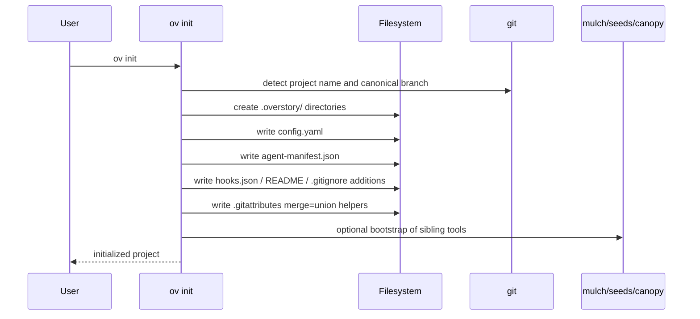
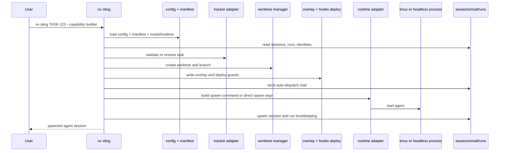
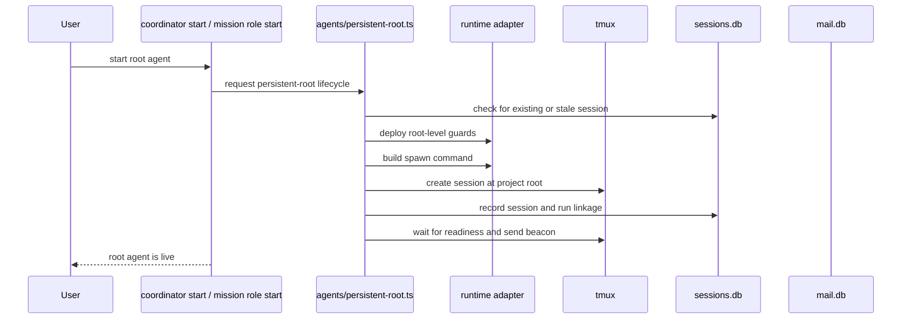
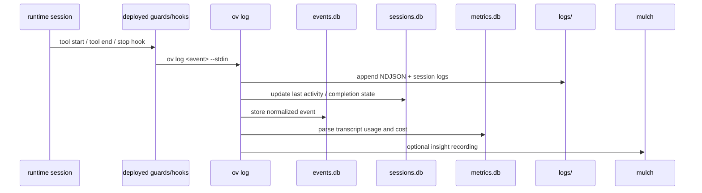
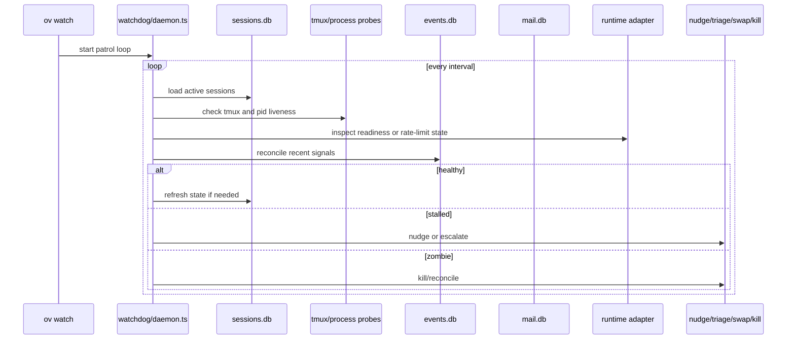
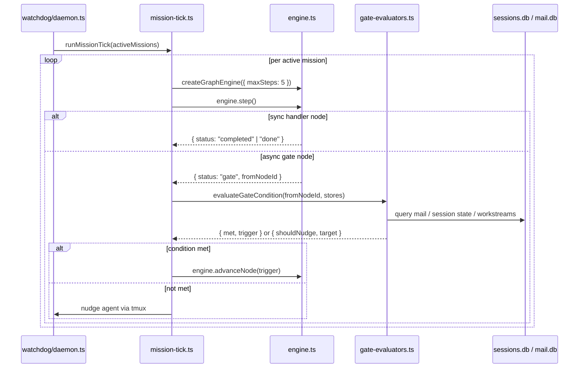
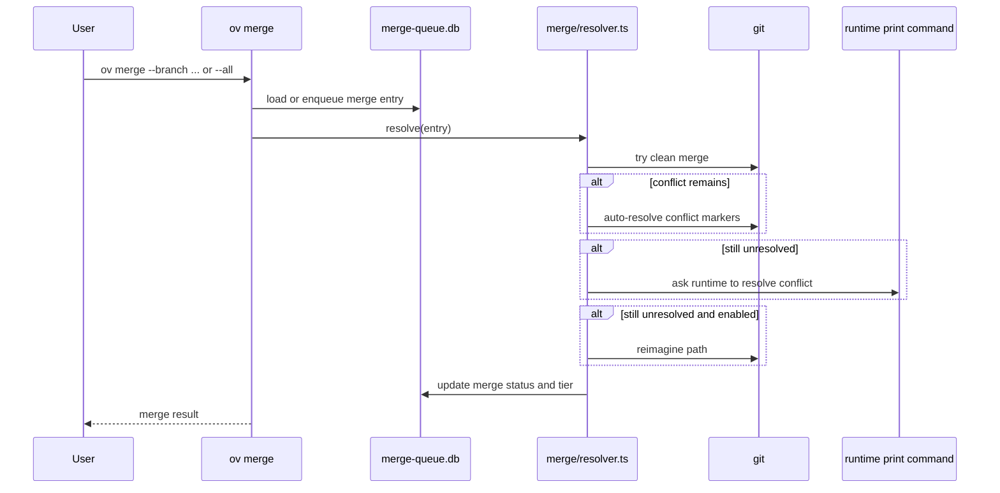
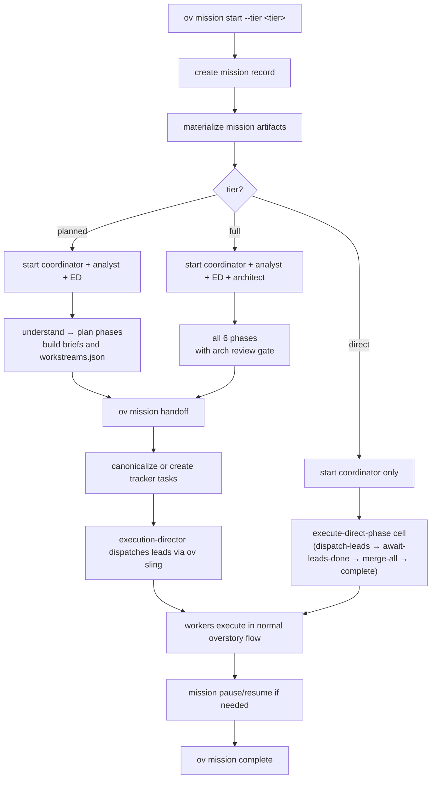

# Overstory Workflows And Diagrams

Repository review date: 2026-04-05  
Inspected commit: `e370026`

This document explains how the architecture works at runtime: bootstrap, worker spawn, persistent coordinator flow, hook ingestion, watchdog recovery, merge, and mission mode.

## 1. Full Command-Family Workflow Map

The command surface is wide, but the workflows collapse into a few families:

| Family | Commands | Core flow |
| --- | --- | --- |
| Bootstrap | `init`, `quickstart`, `hooks`, `update`, `upgrade`, `ecosystem`, `completions` | install config, templates, hooks, guided first-run wizard, and refresh managed state |
| Infrastructure | `config`, `context`, `export`, `webserver`, `research` | manage configuration, project context cache, observability export pipeline, HTTP server, and deep research sessions |
| Spawn and execution | `sling`, `stop`, `attach`, `resume`, `recover`, `snapshot`, `worktree`, `agents` | create or restore agent execution environments |
| Persistent control planes | `coordinator`, `discover`, `monitor`, `supervisor` | run long-lived root agents at project root |
| Mission mode | `mission` | create mission state, root roles, workstreams, pause/resume, handoff, completion |
| Messaging and control | `mail`, `nudge`, `spec`, `workflow`, `group`, `run`, `prime`, `log` | coordination, context injection, workflow import/sync, bookkeeping |
| Delivery | `merge`, `compat` | queue branch merges, resolve conflicts, and check branch compatibility |
| Observability | `status`, `dashboard`, `inspect`, `trace`, `replay`, `feed`, `logs`, `errors`, `costs`, `metrics`, `rate-limits`, `adaptive` | query or stream state derived from stores and logs; inspect rate-limit headroom and adaptive parallelism |
| Health and judgment | `watch`, `review`, `health`, `health-policy`, `next-improvement`, `doctor`, `eval`, `compact`, `clean` | patrol the fleet, score outcomes, manage health policy rules, validate setup, run scenarios, compact expertise records, clean state |

The detailed workflows below cover the lifecycle-critical paths that the rest of the commands orbit around.

## 2. `ov init` Bootstrap Flow

Purpose:

- initialize `.overstory/`
- serialize config
- build starter manifest
- write templates and managed files
- optionally bootstrap sibling os-eco tools



Architectural note:

- `ov init` is the boundary between a generic repo and an overstory-managed repo.
- After this step, the rest of the architecture assumes `.overstory/` exists.

## 3. `ov sling` Worker Spawn Flow

This is the core execution path for non-persistent worker agents.

### Logical phases

1. Load config and manifest.
2. Validate capability, depth, hierarchy, concurrency, and task constraints.
3. Resolve runtime and model.
4. Create or link a run.
5. Create git worktree and branch.
6. Generate overlay instructions and runtime-specific config.
7. Create identity and dispatch mail.
8. Spawn tmux or headless process.
9. Persist session state.



Critical invariant:

- workers run in isolated worktrees
- persistent root agents do not

That single distinction explains a large part of the project structure.

## 4. Persistent Root Agent Flow

This covers `coordinator`, mission root roles, and conceptually `monitor`.

### Root-agent properties

- run at project root
- do not use per-task worktree overlays
- usually persist across more than one worker batch
- rely on mail, tracker state, and checkpoints rather than task-scoped worktree instructions



Where commands differ:

- `coordinator` adds attach/send/ask/output/check-complete behaviors
- mission roles bind into mission state and artifacts
- `monitor` currently duplicates some of this lifecycle instead of fully reusing it

## 5. Hook And Telemetry Flow

Hooks are one of the architectural pivots of the system.

They convert runtime activity into:

- session state updates
- structured events
- log files
- metrics and costs
- insight extraction



Headless runtime variant:

- headless stdout is written to `logs/.../stdout.log`
- `src/events/tailer.ts` tails that file
- parsed NDJSON events are backfilled into `events.db`

## 6. Watchdog And Recovery Flow

`ov watch` runs the tier-0 mechanical daemon.

### What it evaluates

- tmux session liveness
- process liveness
- last activity timestamps
- rate-limit state
- completion signals
- possible headless event-tail needs



Related recovery commands:

- `snapshot` captures store state, worktree state, checkpoints, identities, handoffs.
- `recover` restores bundle content into live state surfaces.
- `resume` attempts to continue a session.

### Graph Engine Lifecycle Controller

The watchdog daemon tick also runs the mission graph engine as an always-on mission lifecycle controller. This happens inside `runDaemonTick()` via `runMissionTick()` in `src/watchdog/mission-tick.ts`.

The engine itself (`src/missions/engine.ts`) is not self-driving. The tick drives it:

1. Reconstruct engine from checkpoint (`checkpointStore.getLatestCheckpoint`)
2. Call `engine.step()` — returns `{ status: "gate" }` if at an async gate
3. Evaluate the gate condition externally in `src/watchdog/gate-evaluators.ts`
4. If condition met — call `engine.advanceNode(trigger)` to unblock the gate
5. If not met — check grace period, nudge if needed, return

`engine.advanceNode()` internally calls `run()`, which can execute a chain of instant handlers and subgraphs. A `maxSteps: 5` option is passed to the engine to cap all operations (including nested subgraph execution) and prevent tick starvation.



The engine operates in two modes:

**Nudge mode** (agent alive but stuck): Phase transition conditions are met but the responsible agent has not acted. The engine sends a tmux nudge with specific guidance. Examples: coordinator has not dispatched analyst after research is ready; exec-director has not dispatched the next workstream after its dependency merged.

**Recovery mode** (agent dead): `evaluateHealth()` marks the agent as zombie. The engine diagnoses the cause and responds: wait for rate-limited agents, respawn after context overflow or crash (up to max retries), suspend the mission and notify the operator if the circuit breaker trips.

## 7. Merge Flow

`ov merge` turns worker branches back into canonical history.

### Resolution tiers

1. clean merge
2. auto-resolve
3. AI resolve
4. reimagine



Architectural note:

- Merge is intentionally separated from worker execution.
- Workers commit to their own branches; the coordinator or operator owns final integration.

## 8. Mission Mode Flow

Mission mode adds a higher-level orchestration model on top of normal worker execution.

### Mission-specific building blocks

- mission record in `sessions.db`
- mission runtime pointers
- artifact root with `mission.md`, decisions, open questions, `plan/workstreams.json`, results
- mission root roles: coordinator, mission-analyst, execution-director
- workstreams that bridge into tracker tasks and then into normal `ov sling` lead dispatch

### Mission Tiers

Missions run in one of three tiers, selected at `ov mission start --tier`. The tier controls which phases are active, which roles are spawned, and which execute-phase cell handles workstream dispatch.

| Tier | Active phases | Roles | Execute cell |
| --- | --- | --- | --- |
| `direct` | `execute → done` | coordinator only | `execute-direct-phase` |
| `planned` | `understand → plan → execute → done` | coordinator + analyst + execution-director | standard execute-phase |
| `full` | `understand → align → decide → plan → execute → done` | coordinator + analyst + execution-director + architect | standard execute-phase + arch review |

The `execute-direct-phase` cell (`src/missions/cells/execute-direct-phase.ts`, `CELL_TYPE="execute-phase"`) provides a simplified execute subgraph for direct-tier missions that skips persistent-agent dispatch and architecture review:

```
dispatch-leads (handler)
  --dispatched-->
await-leads-done (async gate, 14400s)
  --lead_done-->
merge-all (handler)
  --more_leads--> await-leads-done   (LOOP)
  --all_merged-->
complete (terminal)
```

`buildLifecycleGraph()` in `src/missions/engine-wiring.ts` uses `TIER_PHASES` to filter which `phase:active` nodes are included in the lifecycle graph. Skipped phases get their edges reconstructed to connect the preceding phase directly to the next active one, so the graph topology stays valid regardless of tier.



Relationship to the rest of the system:

- mission mode is not a separate engine
- it is a higher-order control plane that reuses the same sessions, mail, runtimes, worktrees, and merge infrastructure

## 9. End-To-End Normal Project Workflow

This is the shortest way to explain how the architecture behaves in practice:

```mermaid
flowchart LR
    A["ov init"] --> B["ov hooks install"]
    B --> C["ov coordinator start or ov discover"]
    C --> D["ov sling ..."]
    D --> E["runtime + worktree execution"]
    E --> F["hooks -> ov log -> sessions/events/metrics/logs"]
    F --> G["ov status/dashboard/inspect/feed"]
    G --> H["ov watch nudges or reconciles if needed"]
    H --> I["ov merge"]
    I --> J["ov review / ov health / ov next-improvement"]
    J --> K["ov snapshot / ov recover if required"]
```



## 10. Why The Workflows Matter More Than The File Tree

The file tree says "many modules".

The runtime says "a few dominant loops":

1. initialize a repo
2. spawn or restore agents
3. collect events and state
4. patrol and reconcile health
5. merge and review outcomes
6. optionally wrap all of that in mission mode

That is the real architecture of Overstory.
